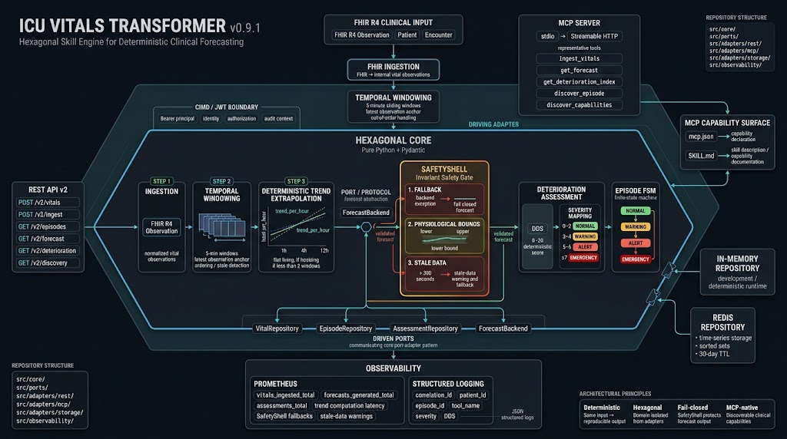

<h1 align="center">ICU Vitals Transformer</h1>
<p align="center">
  <b>Hexagonal Skill Engine — Deterministic Clinical Forecasting via MCP</b>
</p>
<p align="center">
  <a href="#"></a>
  <a href="#"></a>
  <a href="#"></a>
  <a href="#"></a>
  <a href="#"></a>
  <a href="#"></a>
  <a href="#"></a>
  <a href="#"></a>
  <a href="#"></a>
  <a href="#"></a>
  <a href="#"></a>
  <a href="https://github.com/aragit/icu-vitals-transformer/blob/main/CITATION.cff"></a>
  <a href="#"></a>
</p>

<p align="center">
  <b>A Reference Architecture for Safety-First Clinical AI Skills</b>
</p>

<p align="center">
  
</p>


---

## 📋 Table of Contents

- [Clinical Safety Disclaimer](#-clinical-safety-disclaimer)
- [What This Is](#-what-this-is)
- [What This Is Not](#-what-this-is-not)
- [Key Features](#-key-features)
- [Architecture](#-architecture)
- [DDS Severity Tiers](#-dds-severity-tiers)
- [Tech Stack](#-tech-stack)
- [Quick Start](#-quick-start)
- [Configuration](#-configuration)
- [API Reference](#-api-reference)
- [MCP Tools](#-mcp-tools)
- [Observability](#-observability)
- [Testing](#-testing)
- [Architecture Decisions](#-architecture-decisions)
- [Contributing](#-contributing)
- [License](#-license)

---

> **⚠️ CLINICAL SAFETY DISCLAIMER**
>
> This software is **NOT a medical device**. It is **NOT FDA or CE marked** for clinical use.
>
> All forecasts and deterioration scores are **informational only** and **must be reviewed by a qualified clinician** before any clinical action. Do **not** use this tool for:
> - Autonomous triage or diagnosis
> - Closed-loop intervention or alerting
> - Replacement of clinical judgment
>
> The models are **deterministic scoring tools** — they have no understanding of patient context, comorbidities, medications, or treatment plans. Any clinical deployment **must** include human-in-the-loop oversight, validation against local patient populations, and appropriate governance.

## 📖 What This Is

Most clinical AI demos are black-box neural nets wrapped in disclaimers. This is the opposite: a deterministic, symbolic clinical skill that forecasts patient deterioration from FHIR R4 vitals using nothing more than linear trend extrapolation — fully explainable, fully testable, and fully bounded by a SafetyShell invariant gate.
It is designed as a reference implementation for how to build high-integrity AI tools using the Model Context Protocol (MCP). The architecture is protocol-native, not protocol-adapted: the clinical logic lives in a pure-Python hexagonal core with zero framework dependencies, while MCP and REST surfaces are thin, swappable adapters.

**Who this is for**: AI engineers building clinical agent architectures (e.g., AXIOMIS, SentriXIA) who need a trustworthy, deterministic baseline they can compose, extend, and audit — not a magic box they have to trust.


## 🚫 What This Is Not

- **Not an autonomous agent.** This is a deterministic MCP tool/skill. It does not initiate actions, hold goals, or maintain conversational state.
- **Not a neural network.** No ML model, no LLM. Forecasting is linear trend extrapolation with clinical bound clamping.
- **Not FDA/CE marked.** All output is informational only and requires human clinician review.


## ✨ Key Features

| Capability | Detail |
|---|---|
| FHIR R4 Ingestion | LOINC-coded vital signs (HR, BP, SpO₂, RR, Temp, AVPU) with unit validation (°C, mmHg, %, bpm, /min) |
| AVPU Support | Alert / Voice / Pain / Unresponsive via valueQuantity, valueString, or valueCodeableConcept (SNOMED CT) |
| Temporal Windowing | 5-minute sliding windows anchored to the most recent observation; handles out-of-order messages |
| Trend Extrapolation | Pure-Python least-squares slope estimation over historical windows; falls back to flat-line when < 2 windows |
| SafetyShell | Invariant gate: physiological bound clamping, stale-data warning (> 300 s), fail-closed fallback on exception |
| DDS Scoring | Deterministic Deterioration Score (0–20) with explicit contributing factors; severity mapped to clinical tiers |
| Multi-Transport | MCP (stdio / Streamable HTTP), REST v2 |
| Pluggable Storage | In-memory (dev) or Redis (optional, multi-replica, sorted-set time series, 30-day TTL) |
| Observability | Label-free Prometheus metrics + structured JSON logging with correlation IDs |
| Protocol Manifests | mcp.json, SKILL.md for MCP capability negotiation |

## 🏗️ Architecture

`icu-vitals-transformer` is a **Hexagonal Skill Engine**: clinical logic lives in a pure-Python core (`src/core/`) that depends only on the standard library + Pydantic. Adapters handle REST v2, MCP, Redis/memory storage, Prometheus observability, and CIMD/JWT auth at the outer rings.

See [`docs/ARCHITECTURE.md`](docs/ARCHITECTURE.md), [`docs/SAFETY.md`](docs/SAFETY.md), and [`docs/MIGRATION.md`](docs/MIGRATION.md).

### 🔒 Inward Dependency Rule (Hexagonal Core Isolation)

**`src/core/` and `src/ports/` MUST remain 100 % pure Python** — they import none of `fastapi`, `mcp`, `prometheus_client`, `redis`, or `numpy`. This is enforced as a CI gate:

```bash
! grep -rnE 'import (fastapi|mcp|prometheus_client|redis|numpy)' src/core/ src/ports/
```

| Layer | Path | Responsibility |
|-------|------|----------------|
| **Core Domain** | `src/core/domain/*` | Pure Pydantic v2 vital/episode/forecast/assessment contracts |
| **Core Engines** | `src/core/{forecasting,governance,ingestion,windowing,services,safety}` | Deterministic trend extrapolation, DDS, FHIR parsing, episode lifecycle, SafetyShell |
| **Driven Ports** | `src/ports/*.py` | VitalRepository, EpisodeRepository, AssessmentRepository, ForecastBackend protocols |
| **Driving Adapters** | `src/adapters/{rest,mcp}` | REST v2, FastMCP (stdio/http), observability, CIMD auth |
| **Driven Adapters** | `src/adapters/storage/*` | In-memory (default, dev) and optional Redis (multi-replica) via lazy import repository impls |
| **Observability** | `src/observability/*` | Label-free Prometheus metrics + JSON structured logging |

### 🛡️ SafetyShell Invariant Gate

Every forecast output passes through the SafetyShell before reaching any adapter:

```
input: window + trend_per_hour
   │
   ├─ try   → ForecastBackend.forecast()  (deterministic trend extrapolation)
   └─ except → SafetyShell flat-line fallback  (never leaks inner failure)
   ↓
   clamp projected window to physiological BOUNDS
   enforce lower <= forecasted <= upper per channel
   raise stale_data_warning (>300s)
```

The shell is constructed in `src/dependencies.py` with optional `on_fallback` and `on_stale_data` hooks that increment the `safety_shell_fallback_total` and `stale_data_warning_total` counters — core stays framework-free; the Prometheus hooks are wired at the adapter boundary.

## 📊 DDS Severity Tiers

The Deterministic Deterioration Score (DDS) is a bounded composite (0–20) computed from vital sign deviations. It is not NEWS2 — it is a simplified, deterministic variant designed for agentic tool consumption.

| Tier | DDS Range | Clinical Meaning |
|------|-----------|--------|
| NORMAL | 0 – 2 | No immediate physiological concern |
| WARNING | 3 – 4 | Mild derangement; trend monitoring warranted |
| ALERT | 5 – 6 | Significant physiology drift; escalate review |
| EMERGENCY | ≥ 7 | Critical thresholds exceeded; treat as urgent |

AVPU = Unresponsive automatically scores +3 (altered consciousness).

## 🛠️ Tech Stack

- **Python 3.12** + FastAPI + Pydantic v2
- **Deterministic trend extrapolation** — linear forecasting with clinical uncertainty bounds, enforced by SafetyShell
- **ForecastBackends** — ForecastBackend protocol enables future neural/API backends; current implementation is deterministic trend extrapolation only
- **Pluggable repositories** — VitalsRepository/EpisodeRepository ports allow in-memory (dev) or Redis (optional, multi-replica) storage
- **MCP 2026-07-28** — stdio and Streamable HTTP transports; capability negotiation; discover_capabilities tool
- **Prometheus** — label-free observability metrics (no patient_id/episode_id labels)
- **CIMD/JWT** — bearer-token principal extraction for audit trails

## 🚀 Quick Start

```bash
git clone https://github.com/aragit/icu-vitals-transformer.git
cd icu-vitals-transformer
python3 -m venv .venv
source .venv/bin/activate
pip install -r requirements.txt

# Run REST API (default)
uvicorn src.main:app --reload --port 8001

# Run as MCP Streamable HTTP server (production transport)
MCP_TRANSPORT=http uvicorn src.main:app --reload --port 8001

# Run as MCP stdio server (local dev / agent orchestrators)
MCP_TRANSPORT=stdio python -m src.adapters.mcp.server

# Run with Docker
docker compose -f docker/docker-compose.yml up --build
```

## ⚙️ Configuration

| Variable | Default | Description |
|----------|---------|-------------|
| `APP_NAME` | `icu-vitals-transformer` | Application name |
| `APP_VERSION` | `from package metadata` | Application version (read dynamically) |
| `DEBUG` | `false` | Enable debug logging |
| `HOST` | `0.0.0.0` | Server bind address |
| `PORT` | `8000` | Server port |
| `FORECAST_HORIZONS` | `[60, 240, 720]` | Forecast horizons in minutes (1h, 4h, 12h) |
| `MCP_SERVER_NAME` | `icu-vitals-transformer` | MCP server name |
| `REPOSITORY_BACKEND` | `memory` | Storage backend: `memory` (default, dev) or `redis` (optional, multi-replica) |
| `MCP_TRANSPORT` | `stdio` | MCP transport selector (env var) |

## 📡 API Reference

### `POST /v2/vitals/ingest`

Ingest FHIR R4 Observations; auto-resolve or create the active clinical episode.

```bash
curl -X POST http://localhost:8001/v2/vitals/ingest \
  -H "Content-Type: application/json" \
  -d '{
    "patient_id": "PT-001",
    "observations": [
      {
        "resourceType": "Observation",
        "subject": {"reference": "Patient/PT-001"},
        "code": {"coding": [{"system": "http://loinc.org", "code": "8867-4"}]},
        "valueQuantity": {"value": 72, "unit": "bpm"},
        "effectiveDateTime": "2026-07-02T08:00:00Z"
      }
    ]
  }'
```

### `GET /v2/episodes/{episode_id}/current` · `/forecast` · `/deterioration` · `/discovery`

Retrieve the latest windowed vitals, a SafetyShell-bounded forecast, the DDS deterioration index, or the active vital channels for an episode.

### `GET /discover`

Capability-negotiation manifest (protocols, tools, safety bounds).

```bash
curl http://localhost:8001/discover
```

### `GET /health/liveness` and `GET /health/readiness`

Liveness and readiness probes.

### `GET /metrics`

Prometheus metrics endpoint (label-free, no patient identifiers).

## 🔧 MCP Tools

The server exposes tools via the Model Context Protocol:

| Tool | Description |
|------|-------------|
| `ingest_vitals` | Accepts FHIR R4 Observation dicts, returns windowed vital signs + episode ID |
| `get_forecast` | Returns multi-horizon forecast (default 1h; accepts `horizon_minutes`) |
| `get_deterioration_index` | Computes DDS score with severity classification |
| `discover_episode` | Returns the active episode, or a list of all active episodes when multiple exist |
| `discover_capabilities` | Returns the server capability matrix (tools, safety bounds, LOINC mapping) |

Connect via stdio for local agent orchestrators, or Streamable HTTP (`MCP_TRANSPORT=http`, endpoint `http://localhost:8000/mcp`) for tool orchestrators.

### 💻 MCP Tool Example

```python
from mcp import ClientSession, StdioServerParameters
from mcp.client.stdio import stdio_client

params = StdioServerParameters(
    command="python",
    args=["-m", "src.adapters.mcp.server"],
    env={"MCP_TRANSPORT": "stdio"}
)

async with stdio_client(params) as (read, write):
    async with ClientSession(read, write) as session:
        await session.initialize()
        tools = await session.list_tools()
        result = await session.call_tool("get_deterioration_index", {
            "episode_id": "E-<uuid>"  # capture from ingest/open response
        })
```

## 📈 Observability

### 📊 Metrics (Prometheus)

All metrics are label-free to prevent high-cardinality issues with patient identifiers in production.

| Metric | Type | Description |
|--------|------|-------------|
| `vitals_ingested_total` | Counter | Total FHIR observations ingested |
| `forecasts_generated_total` | Counter | Total forecasts generated |
| `assessments_total` | Counter | Total DDS assessments computed |
| `forecast_latency_seconds` | Histogram | Per-horizon forecast latency |
| `forecast_duration_seconds` | Histogram | Forecast service latency |
| `ingest_duration_seconds` | Histogram | Ingest + windowing service latency |
| `safety_shell_fallback_total` | Counter | SafetyShell exception fallbacks |
| `stale_data_warning_total` | Counter | Stale-data warnings triggered |

### 📝 Structured Logging

JSON-formatted logs with correlation IDs, patient_id, episode_id, and tool_name for distributed tracing.

```json
{
  "timestamp": "2026-08-15T10:30:00Z",
  "level": "INFO",
  "message": "Forecast generated",
  "correlation_id": "abc-123",
  "episode_id": "E-a3b2c1d4e5f6",
  "patient_id": "PT-001",
  "tool_name": "get_forecast",
  "horizon_minutes": 60,
  "data_freshness_seconds": 42
}
```

## 🧪 Testing

```bash
pytest -v --cov=src --cov-report=term-missing --cov-fail-under=92
```

**CI gate**: `.github/workflows/ci.yml` enforces Ruff, Mypy, zero framework imports in `src/core` + `src/ports`, and ≥ 92 % coverage. See [`docs/MIGRATION.md`](docs/MIGRATION.md).

## 🧭 Architecture Decisions

See [`docs/ADR-001-episode-id-format.md`](docs/ADR-001-episode-id-format.md) for the episode ID format (`E-<uuid>`); IDs are generated at episode creation — clients must capture `episode_id` from the ingest/open response rather than constructing it. Episode IDs are UUID-based (`E-<uuid>`) and uniquely identify a patient session.

## 💡 Contributing

Fork the repository → Create a feature branch (`git checkout -b feature/my-fix`) → Ensure all CI gates pass locally:

```bash
ruff check src/ tests/
mypy src/core/ src/ports/
pytest --cov=src --cov-fail-under=92
```

Commit with clear messages (`fix(clinical): ...`, `feat(adapter): ...`, `docs: ...`) → Open a pull request.

**Core isolation is mandatory.** Any PR that introduces `fastapi`, `mcp`, `prometheus_client`, `redis`, or `numpy` imports into `src/core/` or `src/ports/` will be rejected by CI.

## 📚 Citation

If you use `icu-vitals-transformer` in your research, clinical agent architecture, or clinical tool orchestration work, please cite it as follows:


```bibtex
@software{icu_vitals_transformer_2026,
  author       = {Arash},
  title        = {ICU Vitals Transformer: A Hexagonal Skill Engine for Deterministic Clinical Forecasting},
  year         = 2026,
  version      = {0.9.1},
  url          = {https://github.com/aragit/icu-vitals-transformer},
  note         = {Reference architecture for MCP-native clinical skills with SafetyShell invariant gates}
}
```
---

## 📄 License

MIT
